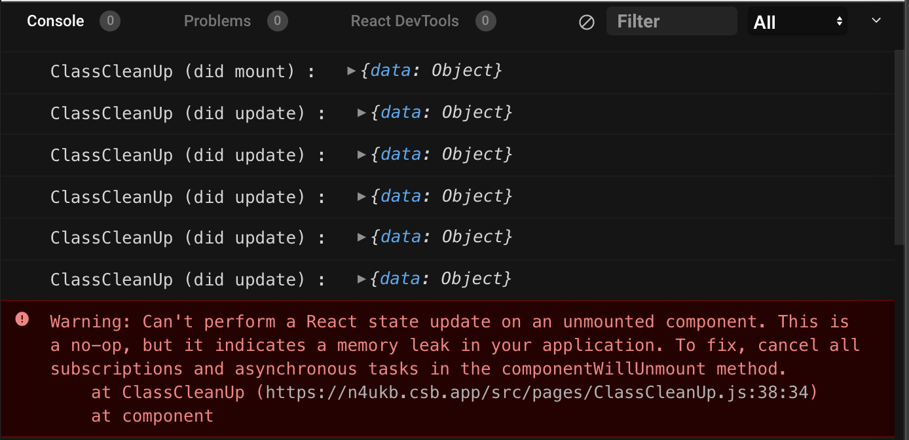

# useEffect 이해하기

## useEffect란?

* useEffect는 명령\(API 등등\) 또는 어떠한 effect를 발생시키는 함수를 받는다.
* side effect는 react 랜더링 단계에 따르면, 함수 컴포넌트의 본문 안에서 허용되지 않는다. But, useEffect Hook을 사용하면 함수 컴포넌트 안에서 side effect 처리가 가능하다.
* useEffect를 컴포넌트 내부에서 사용하는 이유는 자바스크립트의 클로저에 따라 내부의 props, state등을 사용하기 위함이다.


**side effect?**

데이터 가져오기, 구독\(subscription\) 설정, 수동으로 리액트 컴포넌트의 dom을 수정하는 것을 의미한다.


## useEffect의 타이밍

* 기본적으로 랜더링이 마친 후 실행되지만, 업데이트시에만 수행하도록 사용도 가능하다.
* useEffect는 Class component의 생명주기 componentDidMount와 componentDidUpdate, componentWillUnmount가 합쳐진 것과 비슷하게 작동한다. \(그렇다는데..사실 좀... 달라서 좀 다르게 접근하여야한다....\)
* 즉, useEffect가 실행되는 시점은 이미 dom의 랜더링이 완료되었음을 의미한다.

#### ✔️ **mount?**

* React의 컴포넌트가 존재하는 가상 dom을 실제 dom에 삽입하는 것을 의미한다.

#### ✔️ **Class component의 Lifecycle**

* 예재 - 메뉴 1 :[ ](https://codesandbox.io/s/react-useeffect-forked-340rb?file=/src/pages/ClassComponent.js)[https://codesandbox.io/s/react-useeffect-forked-ssv60](https://codesandbox.io/s/react-useeffect-forked-ssv60) \(우측 하단 console 확인\)
* 최초 랜더링/업데이트 모두 같은 side effect를 수행하고싶다면, componentDidMount와 componentDidUpdate메서드를 각각 사용해야하기 때문에 중복 코드가 발생한다. useEffect를 사용하면, 중복 코드를 제거할 수 있다.

#### ✔️ **useEffect와 Class component의 Lifecycle의 차**

<table>
  <thead>
    <tr>
      <th style="text-align:left"></th>
      <th style="text-align:left"></th>
      <th style="text-align:left"></th>
      <th style="text-align:left"></th>
      <th style="text-align:left"></th>
      <th style="text-align:left"></th>
      <th style="text-align:left"></th>
    </tr>
  </thead>
  <tbody>
    <tr>
      <td style="text-align:left">Class</td>
      <td style="text-align:left">&#xCD5C;&#xCD08; &#xB79C;&#xB354;&#xB9C1;</td>
      <td style="text-align:left">props, state &#xC5C5;&#xB370;&#xC774;&#xD2B8;</td>
      <td style="text-align:left">componentDidUpdate &#xC218;&#xD589;&#xC73C;&#xB85C; effect reset</td>
      <td
      style="text-align:left">&#xB9AC;&#xB79C;&#xB354;&#xB9C1;</td>
        <td style="text-align:left">...</td>
        <td style="text-align:left"></td>
    </tr>
    <tr>
      <td style="text-align:left">Hook</td>
      <td style="text-align:left">&#xCD5C;&#xCD08; &#xB79C;&#xB354;&#xB9C1;</td>
      <td style="text-align:left">props, state &#xC5C5;&#xB370;&#xC774;&#xD2B8;</td>
      <td style="text-align:left">&#xB9AC;&#xB79C;&#xB354;&#xB9C1;</td>
      <td style="text-align:left">&#xD074;&#xB9B0;&#xC5C5; &#xD568;&#xC218; &#xC218;&#xD589;&#xC73C;&#xB85C;
        effect reset</td>
      <td style="text-align:left">...</td>
      <td style="text-align:left">
        <p>&#xC2A4;&#xCF54;&#xD504; &#xB54C;&#xBB38;&#xC5D0; effect &#xB0B4;&#xBD80;&#xC758;
          props, state &#xAC12;&#xC774; &#xC5C5;&#xB370;&#xC774;&#xD2B8; &#xB418;&#xAE30;
          &#xC804; &#xAC12;&#xC744; &#xAC00;&#xC9C0;&#xACE0; &#xC788;&#xC744; &#xC218;
          &#xC788;&#xC74C;</p>
        <p>=&gt; effect &#xB0B4;&#xBD80;&#xC5D0;&#xC11C; &#xD56D;&#xC0C1; &#xCD5C;&#xC2E0;
          props, state &#xAC12;&#xC744; &#xAC00;&#xC838;&#xC624;&#xB824;&#xBA74;
          deps&#xB97C; &#xD655;&#xC778;&#xD574;&#xC57C;&#xD55C;&#xB2E4;.</p>
      </td>
    </tr>
  </tbody>
</table>

* 예재 - 메뉴 2 : [https://codesandbox.io/s/react-useeffect-forked-ssv60](https://codesandbox.io/s/react-useeffect-forked-ssv60) \(우측 하단 console 확인\)
  * 최초 랜더링시에만 수행 \(\* useEffect 빈 deps를 추가하고, useEffect 내에서 외부 값을 사용하지 않도록 주의가 필요하다.\)
  * 최초 랜더링/업데이트시에 수행
  * 업데이트시에만 수행

## useEffect의 조건부 발생, 성능 최적화

* 랜더링 이후 effect 적용, 클린업 하는것이 때로는 성능을 저하시킬 수도 있다. \(불필요하게 수행될시..\)

#### ✔️ Class

* componentDidUpdate의 prevProps, prevState를 사용하여 해결이 가능하다.

```jsx
componentDidUpdate = (prevProps, prevState) => {
    if(prevProps !== this.props) {
        // 이전Props와 현재Props가 다를 때만 실행
    }

    if(prevState !== this.state) {
        // 이전Props와 현재Props가 다를 때만 실행
    }
}
```

#### ✔️ **Hook**

* deps 값을 넣어줘 해결이 가능하다.

```jsx
useEffect(()=>{
    // props.status가 업데이트 되었을 때만 실행
},[props.status])

useEffect(()=>{
    // count가 업데이트 되었을 때만 실행
},[count])
```

## useEffect의 의존성 배열...Deps

* useEffect\(function, deps\) : deps를 주시하고 있다가 업데이트 되면 effect를 실행한다.
* deps에 함수를 지정해도 되는가 ?
  * props, state를 사용하지 않는 함수는 컴포넌트 바깥에 선언해 호이스팅한다.
  * effect 내부에서만 사용되는 함수는 effect 내부에 선언한다.
  * 랜더링 범위 안에 있는 함수를 effect가 사용할 경우 해당 함수를 useCallback으로 감싼다.

## useEffect의 정리 \(clean-up function\)



* 외부 데이터를 구독하고 있는 상태라면, 메모리 누수가 발생하지 않도록 컴포넌트가 종료될 때 clean-up function을 실행해주는것이 중요하다.
* Class component는 componentDidUpdate를 사용하여 effect 를 정리할 수 있다.
  * 예재 - 메뉴 4 : [https://codesandbox.io/s/react-useeffect-forked-ssv60](https://codesandbox.io/s/react-useeffect-forked-ssv60) \(우측 하단 console 확인\)
  * 구독을 정리하지않고 unmount 된 경우 componentDidUpdate를 사용하라는 에러가 발생한다.


* Function component는 useEffect를 사용하여 effect 를 정리할 수 있다.
  * 예재 - 메뉴 5 : [https://codesandbox.io/s/react-useeffect-forked-ssv60](https://codesandbox.io/s/react-useeffect-forked-ssv60) \(우측 하단 console 확인\)
  * 구독을 정리하지않고 unmount 된 경우 clean-up function를 사용하라는 에러가 발생한다.


**effect의 clean-up function이 unmount가 아닌 update마다 작동해야하는 이유**

구독하고있는 값이 화면에 표시되어있는 동안 구독값이 변경되었을 때 업데이트 시키지 않으면, 이전 값이 그대로 표시되게 된다.

또한, 업데이트 되지않은 값으로 마운트해치 &gt; 구독해지 호출 과정에서 이전값과 현재값이 맞지않아 메모리 누수나 충돌이 발생할 수 있다.


## useEffect의 사용 팁

### Multiple Effect

* Class의 매소드가 관련없는 로직들을 뭉쳐놓고, 관련있는 로직들은 여러 매소드에 나눠야 하는 문제가 자주 발생하여 이 부분을 해결하기 위해 useEffect hook이 탄생했다.

#### ✔️ Class

* 중복되는 코드가 많고, 이리저리 나눠져있는걸 확인할 수 있다.

```jsx
class FriendStatusWithCounter extends React.Component {
  constructor(props) {
    super(props);
    this.state = { count: 0, isOnline: null };
    this.handleStatusChange = this.handleStatusChange.bind(this);
  }

  componentDidMount() {
    document.title = `You clicked ${this.state.count} times`; // document.title 변경 로직 1
    ChatAPI.subscribeToFriendStatus(
      this.props.friend.id,
      this.handleStatusChange
    ); // 구독 로직 1
  }

  componentDidUpdate() {
    document.title = `You clicked ${this.state.count} times`; // document.title 변경 로직 2
  }

  componentWillUnmount() {
    ChatAPI.unsubscribeFromFriendStatus(
      this.props.friend.id,
      this.handleStatusChange
    ); // 구독 로직 2
  }

  handleStatusChange(status) {
    this.setState({
      isOnline: status.isOnline
    });
  }
```

#### ✔️ **Hook**

* 목적에 따라 코드를 나눠놓을 수 있다.

```jsx
function FriendStatusWithCounter(props) {
  const [count, setCount] = useState(0);
  useEffect(() => {
    document.title = `You clicked ${count} times`;
  }); // document.title 변경 로직

  const [isOnline, setIsOnline] = useState(null);
  useEffect(() => {
    function handleStatusChange(status) {
      setIsOnline(status.isOnline);
    }

    ChatAPI.subscribeToFriendStatus(props.friend.id, handleStatusChange);
    return () => {
      ChatAPI.unsubscribeFromFriendStatus(props.friend.id, handleStatusChange);
    };
  }); // 구독 로직
}
```

## useEffect와 ~~useLayoutEffect~~

* 리액트 공식문서에서도 사용을 지양하길 권하고 있어 내용 제거

## 마무리

* useEffect는 랜더링시 재실행되는 것이 아니다. 랜더링시마다 새로운 useEffect가 수행되는 것..
* 앞으로는 잘 알고 씁시다.

## 참조

* [https://ko.reactjs.org/docs/hooks-reference.html\#useeffect](https://ko.reactjs.org/docs/hooks-reference.html#useeffect)
* [https://ko.reactjs.org/docs/hooks-faq.html\#what-can-i-do-if-my-effect-dependencies-change-too-often](https://ko.reactjs.org/docs/hooks-faq.html#what-can-i-do-if-my-effect-dependencies-change-too-often)
* [https://rinae.dev/posts/a-complete-guide-to-useeffect-ko](https://rinae.dev/posts/a-complete-guide-to-useeffect-ko)
* [https://velopert.com/1130](https://velopert.com/1130)

