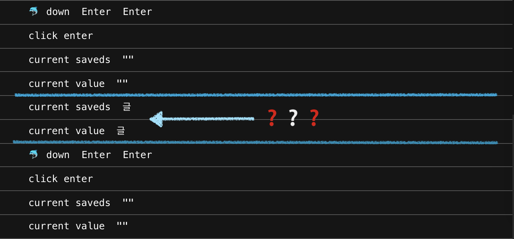
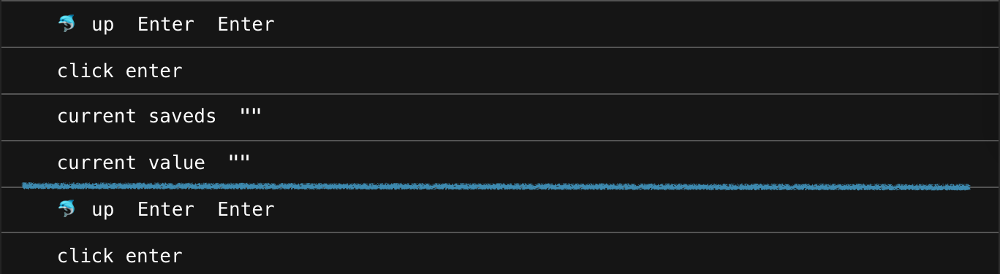
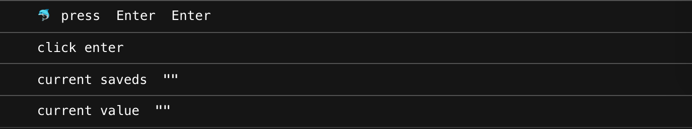

# keybord event에 대한 분석

## 😦 사건의 발단


input 값 입력 → `onKeyDown`를 통해 갱신/enter key 감지 → 저장 → input 값 초기화


위와 같은 기능을 구현하다가 한글을 입력 후 `onKeyDown`을 통해 enter key를 누르면 입력된 값을 저장 하니 마지막 1문자가 씹혀나오는 현상이 있었다.

일단은 `onKeyPress`로 변경하여 마무리하였지만, 정확한 문제를 모르니 찝찝하여 한번 다뤄보자고 생각하게 되었고, \(드디어\) 정리를 해보려고한다.

## 👩🏽‍💻 keybord event

키보드 이벤트란 사용자가 키를 누르거나 놓았을 때 발생하는 이벤트이다.

이벤트 발생 순서는 다음과 같다.

`keyDown` → `keyPress` → `keyUp`

## ⌨️ keybord event 종류

### keyUp

* 키를 놓았을 때 발생
* 조합형 문자, Backspace/Control/Shift 등 인식 가능
* 입력되는 문자의 갯수가 일치함

### keyDown

* 키를 누를 때 마다 발생
* 조합형 문자, Backspace/Control/Shift 등 인식 가능
* 누를 때 기준으로 1문자 씩 밀려 인지한다.

### keyPress

* 문자가 입력될 때 발생
* 조합형 문자, Backspace/Control/Shift 등은 인식 불가
* 더 이상 새로운 브라우저에서 지원을 하지 않을 예정이라하니 사용을 지양하는게 좋겠다.

## 👾 onKeyDown bug??

`onKeyDown`을 사용하여 input에 문자를 후 enter를 누르면 저장이 되는 기능을 구현하다가 조금 이상한 부분을 발견하였다.

영문이나 숫자 입력시에는 문제가 없는데 한글을 입력한 후 enter를 누르면,


위 예시 처럼 마지막 1글자가 씹혀서 같이 저장되는 문제였다.

아래처럼 enter key가 눌렸을 때 이벤트가 2번 실행되면서 문제가 발생했다.

그럼, 비교를 위해 `onKeyDown` 외에 다른 이벤트의 경우도 확인해보자.

### onKeyDown



저장 후 정리되는 것 까지는 괜찮다. 하지만 enter가 2번째 호출되기 전 마지막 1문자가 다시 업데이트 된 것을 확인할 수 있었다. \(저 아이는 어디서 오는걸까...?\)

### onKeyUp



이벤트가 2번 실행되긴한다. 하지만 저장이되면서 input에 입력되었던 값은 깔끔하게 지워졌고, 입력된 값이 없으면 저장하지 않는 로직을 추가해놔서 씹히는 문제는 발생하지 않는다.

### onKeyPress



사실상 `onKeyPress`는 enter를 누르기 전 한글을 입력하는 동안은 이벤트가 실행되지 않았다. 그래서 깔끔하게 1번만 실행되고 마무리 되지만, 이거야말로 다른 기능 구현시 이슈가 발생할 수 있지 않을까 싶었고, 비권장 기능이니 좋은 방법 아니다.

## 🔠 조합형 문자와 완성형 문자

## 💊 이렇게 해결해보자.

code sandbox : [https://codesandbox.io/s/key-event-test-8sbz4](https://codesandbox.io/s/key-event-test-8sbz4)

### A. 간단하게 onKeyUp을 사용하자.

`onKeyUp`도 이벤트가 2번 실행되는건 동일하다.

의도치않은 빈값이 들어갈 수 있기 때문에 주석 step3처럼 확인해주는 과정을 거쳐야한다.

```javascript
// step1. 키 이벤트가 발생
const handleKeyup = (event) => {
	// step2-a. 입력된 key가 enter인지 확인한다.
	if (event.code === "Enter" && event.key === "Enter") {
		// step3. value가 있는 상태인지 확인한다.
    if (value) {
			// step4. value를 저장하고, 초기화시킨다.
	    setSaveds([...saveds, value]);
	    setValue("");
	  }
	}

	// step2-b. enter가 아니면 이벤트를 종료한다.
	return false;
};
```

* 해결은 된다. 불필요한 이벤트 발생 부분이 뭔가 찝찝...

### B. throttle를 사용해보자.

throttle는 일정 시간안에 중복이벤트가 발생해도 1번만 처리되게끔 해주는 방식이다.

```javascript
let throttling = null;

const handleKeyup = (event) => {
	if (event.code === "Enter" && event.key === "Enter") {
		if (!throttling) {
			setTimeout(() => {
		    if (value) {
			    setSaveds([...saveds, value]);
			    setValue("");
			  }
      }, 100);
		}
		throttling = true;
	}

	return false;
};
```

* lodash를 활용하면 더욱 편리하게 사용이 가능하다.
* 자매품 debounce도 있다. 다음글에 다뤄봐야겠다.

## 마무리

이전에 회사 프로젝트 진행시 draft.js를 사용하여 에디터를 만들게 되었었고 그때도 조합형 문자 때문에 문제가 있었는데 또 다시 조합형 문자 문제로 의심되는 현상을 만나 이번 기회에 좀 더 알아보자는 마음이였다.

사실 조합형 문자에 대 정확히 이해하진 않았다. 앞으로 문자 관련 기능 구현시 좀 더 주의하게 될 것 같다.

## 참고

* [https://xetown.com/tips/11368](https://xetown.com/tips/11368)
* [https://tapito.tistory.com/529](https://tapito.tistory.com/529)
* [https://m.blog.naver.com/PostView.naver?isHttpsRedirect=true&blogId=lovefavaz&logNo=140124605492](https://m.blog.naver.com/PostView.naver?isHttpsRedirect=true&blogId=lovefavaz&logNo=140124605492)

